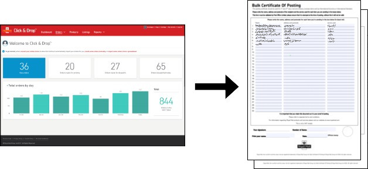

# Click & Drop Print Helper

Click & Drop Print Helper is a tool designed to automate the printing of labels, packing slips, and proof of postage documents from the Click & Drop service. The application now includes a graphical user interface (GUI) with a system tray icon, configuration windows, and the existing console version for command-line usage.



I am not affiliated with Royal Mail; as a customer, I developed this tool to address certain features I felt were missing in their Click & Drop service.​

## Features

- **GUI Version**:
   - System tray icon for easy access
   - Configuration window to set up and save settings
   - Console window to view logs and output
- **Console Version**:
   - Command-line interface for users who prefer terminal usage
- **File Watching**:
   - Monitors specified folders for new PDF files
   - Automatically processes and prints documents based on configuration

## Requirements

- Java 11 or higher
- Maven
- Have an account with Royal Mail Click & Drop

## Click & Drop settings
The label format will need to be set as:
- Choose printout format: Separate label & dispatch note
- Choose label format: A4
- Choose dispatch note format: A4
- Choose additional options: Un-tick 'Generate custom declarations with orders' & 'Generate proof of postage with orders'
- Labels per page: 4

## Dependencies

- Apache PDFBox
- Apache Commons IO
- JAI ImageIO Core

## Installation

1. Clone the repository:
    ```sh
    git clone https://github.com/yourusername/ClickDropPrintHelper.git
    cd ClickDropPrintHelper
    ```

2. Build the project using Maven:
    ```sh
    mvn clean install
    ```

## Usage

### GUI Version

1. Run the application:
    ```sh
    java -jar target/clickdropprinthelper.jar
    ```

2. The application will start with a system tray icon. Right-click the icon to access the following options:

- Console: Opens the console window to view logs and output.
- Configuration: Opens the configuration window to set up and save settings.
- Exit: Closes the application.

## Console Version

Run the application with the configuration file:
```sh
java -cp target/clickdropprinthelper.jar com.newfangledthings.clickdropprinthelper.ConsoleApp config.properties
```

The application will run in the terminal, monitoring the specified folders and processing documents based on the configuration.

## Configuration

Create a `config.properties` file in the root directory with the following properties.  This will be generated automatically on first run if it does nto exist. This can also be updated from the Config Window in the GUI version.

```properties
# Folder to monitor for new PDF files, usually your downloads folder.
# This is the directory where the application will look for new PDF files to process.
# Example: C:/Users/YourUsername/Downloads
WatchFolder=path/to/watch/folder

# Folder for storing the generated PDFs.
# This can be the same as the WatchFolder or a different directory where you want to save the processed files.
# Example: C:/Users/YourUsername/Documents/ProcessedPDFs
StoreFolder=path/to/store/folder

# Whether to create proof of postage documents.
# Set to 'yes' to generate proof of postage documents from the shipping labels.
# Set to 'no' if you do not want to create proof of postage documents.
# Valid values: yes, no
CreateProofOfPostage=yes

# Whether to add QR codes page to proof of postage documents.
# Set to 'yes' to add QR codes to the proof of postage documents.
# Set to 'no' if you do not want to add QR codes.
# Valid values: yes, no
CreateQRs=yes

# Whether to create a separate labels PDF.
# Set to 'yes' to generate a separate PDF containing only the labels.
# Set to 'no' if you do not want to create a separate labels PDF.
# Valid values: yes, no
CreateLabels=yes

# Whether to create a separate packing slips PDF.
# Set to 'yes' to generate a separate PDF containing packing slips.
# Set to 'no' if you do not want to create packing slips.
# Valid values: yes, no
CreatePackingSlips=yes

# Path to the header image for packing slips (optional).
# If you want to include a header image in the packing slips, specify the path to the image file here.
# Leave this blank if you do not want to include a header image.
# Example: C:/Users/YourUsername/Documents/HeaderImage.png
PackingSlipHeaderImage=path/to/header/image

# Path to the footer image for packing slips (optional).
# If you want to include a footer image in the packing slips, specify the path to the image file here.
# Leave this blank if you do not want to include a footer image.
# Example: C:/Users/YourUsername/Documents/FooterImage.png
PackingSlipFooterImage=path/to/footer/image

# Whether to stop watching the folder after the first run.
# Set to 'yes' to stop the application after processing the first set of files.
# Set to 'no' to keep the application running and continue monitoring the folder for new files.
# Valid values: yes, no
StopWatchAfterFirstRun=no

# Command to execute the PDF viewer for packing slips.
# Specify the command to open the generated packing slips PDF.
# Example: "C:/Program Files/Adobe/Acrobat DC/Acrobat/Acrobat.exe" /t "%filename%" "Paper Printer"
ViewerExecutePackingSlip="path/to/pdf/viewer" /t "%filename%" "Paper Printer"

# Command to execute the PDF viewer for labels.
# Specify the command to open the generated labels PDF.
# Example: "C:\Program Files\Google\Chrome\Application\chrome.exe"
ViewerExecuteLabels="path/to/pdf/viewer" "%filename%"

# Command to execute the PDF viewer for proof of postage.
# Specify the command to open the generated proof of postage PDF.
# Example: "C:\Program Files\Foxit Software\Foxit Reader\FoxitReader.exe"
ViewerExecuteProofOfPostage="path/to/pdf/viewer"

# Delay in seconds before processing the next file.
# This delay helps to prevent file locking issues.
# Example: 1
ViewerDelay=1
